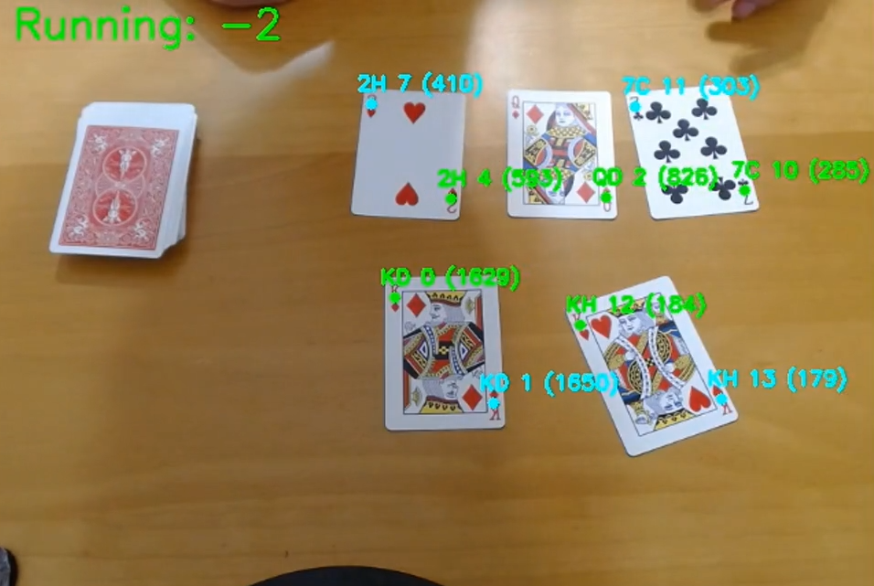
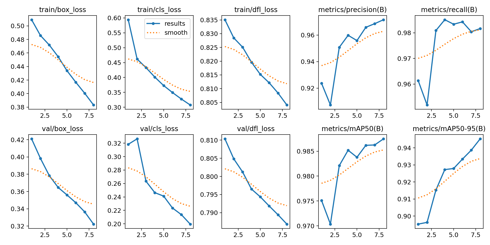
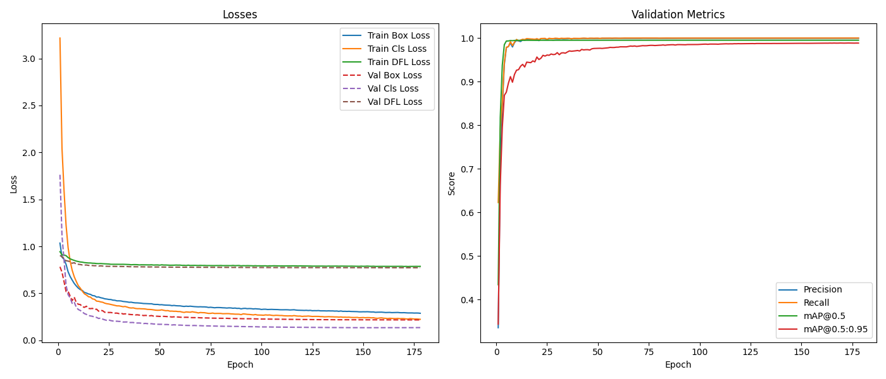

# Real-Time Blackjack Card Counter

A computer vision system that detects and classifies playing cards in real time to count cards in blackjack using the Hi-Lo counting system. This project combines deep learning object detection with sophisticated tracking algorithms to replicate what professional card counters do mentally.

## Demo

### Watch the System in Action
[](https://youtu.be/Up7d6KC7Rio)
 

### Training Results

The model was trained using Google Colab's GPU resources with multiple iterations across different datasets and augmentations to achieve robust performance in various conditions.

**Validation Performance Metrics**


**Training Loss Progress**


## Getting Started

These instructions will get you a copy of the project up and running on your local machine for development and testing purposes. The system requires a webcam for real time card detection and classification.

### Prerequisites

What things you need to install the software and how to install them

```
Python 3.8 or higher
Webcam or video capture device
CUDA-capable GPU (recommended for optimal performance)
```

The core dependencies include:

```
ultralytics>=8.0.0
opencv-python>=4.5.0
numpy>=1.21.0
```

### Installing

A step by step series of examples that tell you how to get a development environment running

Clone the repository to your local machine

```
git clone https://github.com/tomalmog/CV-CardCounting.git
cd CV-CardCounting
```

Install the required Python packages

```
pip install ultralytics opencv-python numpy
```

The trained model (model.pt) is included in the repository and located in the main directory alongside the Python files - no additional setup required.

Test the installation by running the main script

```
python main.py
```

You should see a window open showing your camera feed with card detection capabilities. Press ESC to exit.

## Built With

* [Ultralytics YOLOv8](https://github.com/ultralytics/ultralytics) - Object detection framework
* [OpenCV](https://opencv.org/) - Computer vision and image processing
* [NumPy](https://numpy.org/) - Mathematical operations and array processing
* [PyTorch](https://pytorch.org/) - Deep learning framework (via Ultralytics)
* [Google Colab](https://colab.research.google.com/) - GPU training environment

## Author

* **Tom Almog** - [tomalmog](https://github.com/tomalmog)

**Disclaimer**: This project is for educational and research purposes only. It demonstrates computer vision and machine learning techniques applied to object detection and tracking. The system is not intended for actual casino use.
